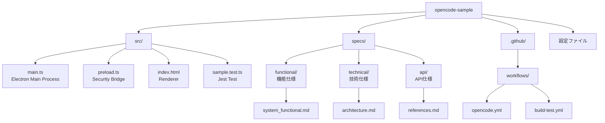

# AGENTS.md - OpenCode 用設定ファイル

## プロジェクト構成図



## フォルダ構成

| フォルダ | 説明 |
|---------|------|
| `src/` | ソースコード（Electron Main/Preload/Renderer） |
| `specs/` | OpenSpec 仕様に基づく仕様書群 |
| `specs/functional/` | 機能仕様書 |
| `specs/technical/` | 技術仕様書 |
| `specs/api/` | API仕様書 |
| `.github/workflows/` | CI/CD ワークフロー |
| `dist/` | TypeScript コンパイル出力 |
| `dist-electron/` | パッケージング済みアプリ |

## タスク実行コマンド

```bash
# 依存関係インストール
npm install

# 開発サーバー起動
npm start

# ビルド
npm run build

# テスト実行
npm test

# パッケージング
npm run build:package
```
