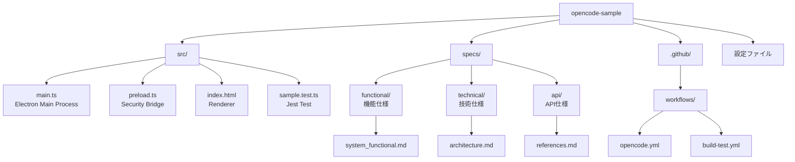

# OpenCode Sample

TypeScript + Electron + Volta プロジェクトのサンプルアプリケーションです。

## プロジェクト概要

Electron を使用したデスクトップアプリケーションのテンプレートプロジェクトです。TypeScript で記述され、Volta による Node.js バージョン管理、Jest によるテスト、electron-builder によるパッケージングを備えています。

## プロジェクト構成



### フォルダ構成

| フォルダ | 説明 |
|---------|------|
| `src/` | ソースコード（Electron Main/Preload/Renderer） |
| `specs/functional/` | 機能仕様書 |
| `specs/technical/` | 技術仕様書 |
| `specs/api/` | API仕様書 |
| `.github/workflows/` | CI/CD ワークフロー |
| `dist/` | TypeScript コンパイル出力 |
| `dist-electron/` | パッケージング済みアプリ |

```
.
├── src/
│   ├── main.ts       (Electron main process - ウィンドウ管理等)
│   ├── preload.ts    (Preload script - セキュリティ境界のbridge)
│   ├── index.html    (HTML entry point - レンダラープロセス)
│   └── sample.test.ts (Jest テスト)
├── specs/
│   ├── functional/   (機能仕様)
│   │   └── system_functional.md
│   ├── technical/    (技術仕様)
│   │   └── architecture.md
│   └── api/          (API仕様)
│       └── references.md
├── dist/             (TypeScript コンパイル後のJavaScript)
├── dist-electron/    (パッケージング済みアプリケーション)
├── .github/workflows/
│   ├── opencode.yml   (コメントトリガー用)
│   └── build-test.yml (build/test用CI/CD)
├── package.json
├── tsconfig.json
├── jest.config.js
└── README.md
```

## 技術スタック

| 技術 | バージョン/設定 |
|------|----------------|
| TypeScript | ES2020 target, CommonJS modules |
| Electron | v40.2.1 |
| Volta | Node.js v22.12.0 |
| Jest | テストフレームワーク (ts-jest対応) |
| electron-builder | アプリケーションパッケージング |

## Node.js バージョンについて

当初 Node.js v24.13.1 を使用していましたが、Electron v40.2.1 との互換性問題により **v22.12.0** に変更しました。Electron v40.2.1 は Node v22.22.0 に基づいており、v24 では一部の依存関係が正常に動作しませんでした。

Volta を使用しているため、`npm install` 時に自動的に Node.js v22.12.0 がインストールされます。

## CI/CD ワークフロー

### `.github/workflows/opencode.yml`
- コメントトリガーで実行
- opencode AI との連携用

### `.github/workflows/build-test.yml`
- `pull_request` イベントで自動実行
- Node.js v22.12.0 で依存関係をインストール
- `npm run build` で TypeScript をビルド
- `npm test` で Jest テストを実行

## 必要条件

- Node.js v22.12.0 (Volta により自動管理)
- npm

## インストール

```bash
npm install
```

## 開発

アプリケーションを起動:

```bash
npm start
```

## ビルド

TypeScript をコンパイル:

```bash
npm run build
```

## テスト

テストを実行:

```bash
npm test
```

## パッケージング

Electron アプリケーションをパッケージ化:

```bash
npm run build
npm run build:package
```

生成されたパッケージは `dist-electron` ディレクトリに出力されます:

| プラットフォーム | 出力形式 |
|---------------|---------|
| macOS | `.dmg` ファイル |
| Windows | `.exe` ファイル (NSIS) |
| Linux | `.AppImage` ファイル |

## ライセンス

ISC
