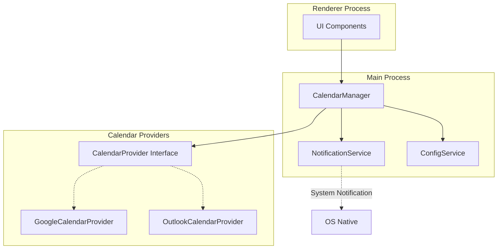

# 技術仕様書

---

## 1. システム構成

| コンポーネント | 技術 | バージョン |
|--------------|------|-----------|
| フロントエンド | Electron | v40.2.1 |
| メイン言語 | TypeScript | ES2020 |
| テスト | Jest | - |
| ビルドツール | electron-builder | - |
| Node.js管理 | Volta | v22.12.0 |

---

## 2. アーキテクチャ

### 2.1 プロセス構成

- **Main Process**: Electron メインプロセス（ウィンドウ管理、Native API呼び出し）
- **Preload Script**: セキュリティ境界のbridge（contextBridge使用）
- **Renderer Process**: HTML/CSS/JSによるUI描画

### 2.2 モジュール構成

```
src/
├── main.ts        # メインプロセスエントリ
├── preload.ts     # Preload script
└── index.html    # Rendererエントリ
```

### 2.3 アーキテクチャ図



---

## 3. 技術制約

- マルチカレンダー対応（抽象化されたCalendar Providerインターフェース）
- タイムゾーン: Asia/Tokyo（デフォルト）
- ターゲット: Windows/macOS/Linux

---

## 4. モジュール設計

### 4.1 モジュール構成

```
src/
├── main.ts                    # メインプロセスエントリ
├── preload.ts                 # Preload script
├── index.html                # Rendererエントリ
├── core/
│   ├── CalendarProvider.ts   # Provider抽象インターフェース
│   └── EventParser.ts       # イベント抽出・解析
├── providers/
│   ├── GoogleCalendarProvider.ts   # Google Calendar実装
│   ├── OutlookCalendarProvider.ts # Outlook Calendar実装（拡張用）
│   └── MockProvider.ts            # テスト用Provider
└── services/
    ├── NotificationService.ts     # 通知サービス
    └── ConfigService.ts           # 設定管理
```

### 4.2 Calendar Provider抽象インターフェース

```typescript
interface CalendarProvider {
  readonly name: string;
  readonly authType: 'oauth' | 'cookie' | 'none';
  
  authenticate(credentials: AuthCredentials): Promise<boolean>;
  fetchEvents(startDate: Date, endDate: Date): Promise<CalendarEvent[]>;
  parseVideoConference(event: CalendarEvent): VideoConferenceInfo | null;
}
```

### 4.3 責務定義

| モジュール | 責務 |
|-----------|------|
| CalendarProvider | カレンダーAPIアクセス抽象化、各プロバイダー実装のインターフェース |
| EventParser | イベントデータ正規化、ビデオリンク抽出ロジック |
| NotificationService | ポップアップ通知の表示・送信制御 |
| ConfigService | ユーザー設定（ Provider選択、通知設定等）の永続化管理 |
