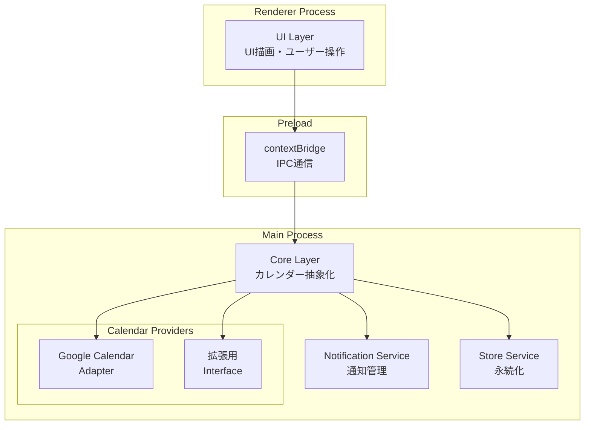

# 技術仕様書

---

## 1. システム構成

| コンポーネント | 技術 | バージョン |
|--------------|------|-----------|
| フロントエンド | Electron | v40.2.1 |
| メイン言語 | TypeScript | ES2020 |
| テスト | Jest | - |
| ビルドツール | electron-builder | - |
| Node.js管理 | Volta | v22.12.0 |

---

## 2. アーキテクチャ

### 2.1 プロセス構成

- **Main Process**: Electron メインプロセス（ウィンドウ管理、Native API呼び出し）
- **Preload Script**: セキュリティ境界のbridge（contextBridge使用）
- **Renderer Process**: HTML/CSS/JSによるUI描画

### 2.2 アーキテクチャ図



### 2.3 モジュール構成

```
src/
├── main.ts                 # メインプロセスエントリ
├── preload.ts              # Preload script
├── core/
│   ├── CalendarManager.ts  # カレンダー抽象化管理
│   └── types.ts            # 共通型定義
├── adapters/
│   ├── GoogleCalendarAdapter.ts   # Google Calendar 実装
│   └── CalendarAdapter.ts         # Adapter Interface
├── services/
│   ├── NotificationService.ts     # 通知サービス
│   └── StorageService.ts          # 永続化サービス
└── renderer/
    └── index.html         # Rendererエントリ
```

---

## 3. モジュール・コンポーネント設計

### 3.1 CalendarAdapter Interface

```typescript
interface CalendarAdapter {
  provider: CalendarProvider;
  setCalendarEmail(email: string): void;
  fetchEvents(date: Date): Promise<CalendarEvent[]>;
  getStatus(): AdapterStatus;
}
```

**責務**: 各カレンダーProviderへの統一アクセスInterface、提供者固有の実装を隠蔽

> **注**: 公開URLembed形式のため、OAuth認証は不要

### 3.2 CalendarManager

**責務**: 
- 現在アクティブなAdapterの切り替え管理
- イベント取得エラーハンドリング
- Adapter間の統一的なデータ変換

### 3.3 GoogleCalendarAdapter

**責務**:
- Google Calendar 公開URL（embed形式）からのイベント取得
- イベントデータのパース（Google固有のconferenceData解析）
- Google Meet/Zoom/Teamsリンク抽出

### 3.4 NotificationService

**責務**:
- ミーティング開始前通知の管理
- 重複通知防止ロジック
- 通知済みイベントIDの永続化管理

### 3.5 StorageService

**責務**:
- ユーザー設定の保存
- 通知済みミーティングIDの永続化
- Adapter設定の切り替え管理

---

## 4. 技術制約

- カレンダーAPIに依存しないクライアントサイド実装（公開URLのEmbed表示によるイベント取得）
  - Google Calendar: `https://calendar.google.com/calendar/embed?src=${email}&ctz=Asia%2FTokyo`
  - OAuth認証やAPIキー不要で、API利用制限のあるユーザーでも利用可能
- タイムゾーン: Asia/Tokyo（デフォルト）
- ターゲット: Windows/macOS/Linux

---

## 5. 拡張性

### 5.1 新規カレンダーProvider追加

新しいカレンダーProviderを追加する場合、`CalendarAdapter` Interfaceを実装したクラスを `adapters/` 配下に追加し、`CalendarManager` に登録する。

```typescript
// 例: Yahoo Calendar追加時
import { CalendarAdapter } from './CalendarAdapter';

export class YahooCalendarAdapter implements CalendarAdapter {
  provider: CalendarProvider = 'yahoo';
  // ... implement methods
}
```

### 5.2 対応予定Provider

| Provider | 状態 | 優先度 |
|----------|------|:------:|
| Google Calendar | 実装予定 | P0 |
